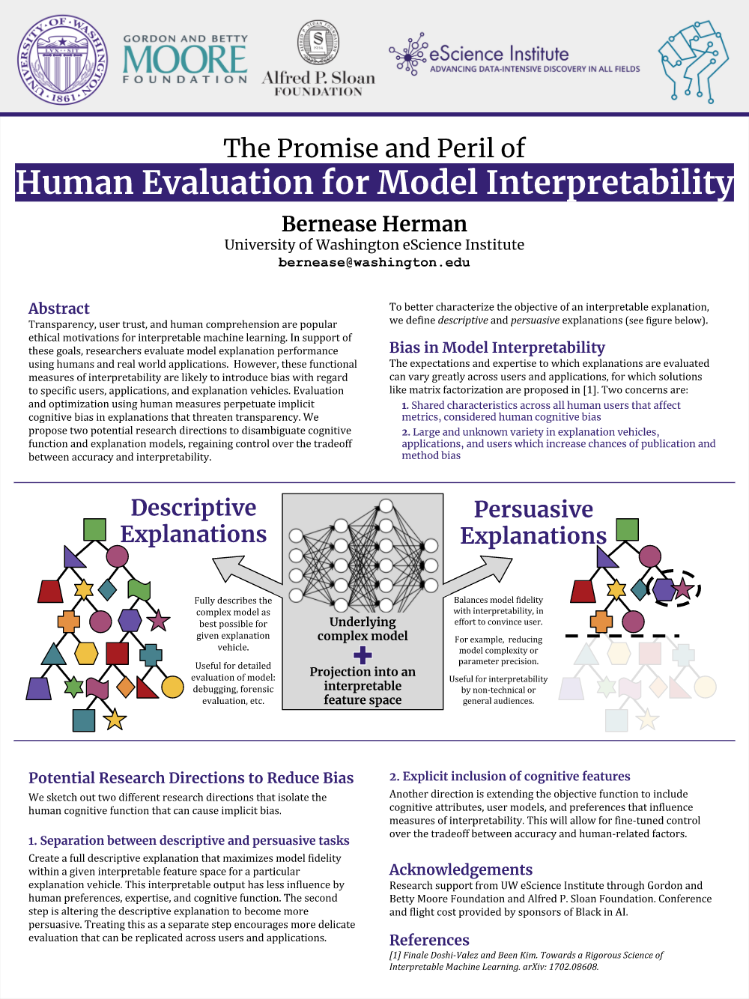

## Relevant Symposia and Workshops from NIPS 2017

* Symposium on Interpretable Machine, **presented poster** [[webpage](http://interpretable.ml)]
* Transparent and Interpretable ML in Safety Critical Environments workshop [[webpage](http://sites.google.com/view/timl-nips2017)]
* Black in AI workshop and dinner, **presented poster** [[webpage](http://blackinai.org)]
* Learning Disentangled Representations: from Perception to Control [[website](https://sites.google.com/view/disentanglenips2017)]
* Interpreting, Explaining and Visualizing Deep Learning [[website](http://www.interpretable-ml.org/nips2017workshop)]
* Cognitively Informed Artificial Intelligence (CIAI) workshop [[website](https://sites.google.com/view/ciai2017/)]

 

### The Promise and Peril of Human Evaluation for Model Interpretability

#### Abstract

Transparency, user trust, and human comprehension are popular ethical motivations for interpretable machine learning. In support of these goals, researchers evaluate model explanation performance using humans and real world applications.  However, these functional measures of interpretability are likely to introduce bias with regard to specific users, applications, and explanation vehicles. Evaluation and optimization using human measures perpetuate implicit cognitive bias in explanations that threaten transparency. We propose two potential research directions to disambiguate cognitive function and explanation models, regaining control over the tradeoff between accuracy and interpretability.

#### Paper

The Promise and Peril of Human Evaluation for Model Interpretability

[[arXiv](https://arxiv.org/abs/1711.07414)] [[pdf](https://arxiv.org/pdf/1711.07414.pdf)]

Published on arXiv as a part of the Proceedings of NIPS 2017 Symposium on Interpretable Machine Learning

[[full proceedings](https://arxiv.org/abs/1711.09889)]

#### Poster

Extended poster [[png](../assets/images/extendedNIPS17poster.png  )]. Presented at NIPS 2017 Symposium on Interpretable Machine Learning.

Original Poster [[png](../assets/images/originalNIPS17poster.png)]. Presented at the Black In AI workshop co-located with NIPS 2017.

